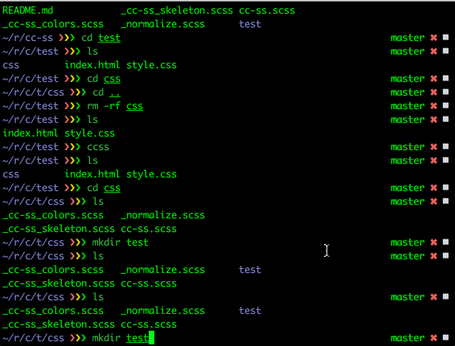
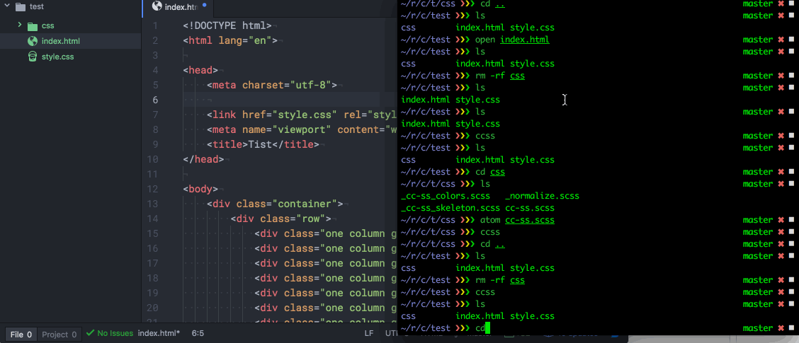
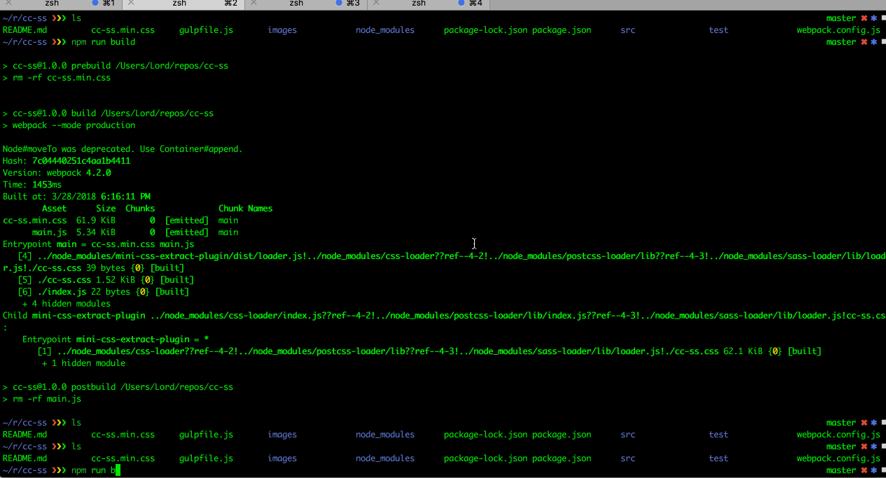

# cc-ss

CSS framework w/ some SASS

Built using the following resources:

- [Normalize][1]
- [Skeleton][2]
- [clrs][3]

## Alias Demo

### Compiler Demo

### Webpack Demo

[1]: https://necolas.github.io/normalize.css/
[2]: http://getskeleton.com/
[3]: http://clrs.cc
